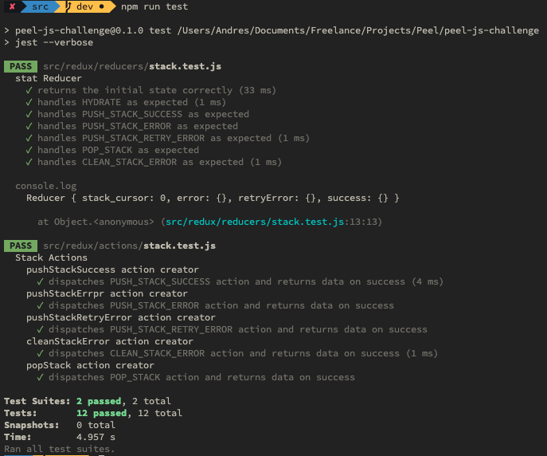
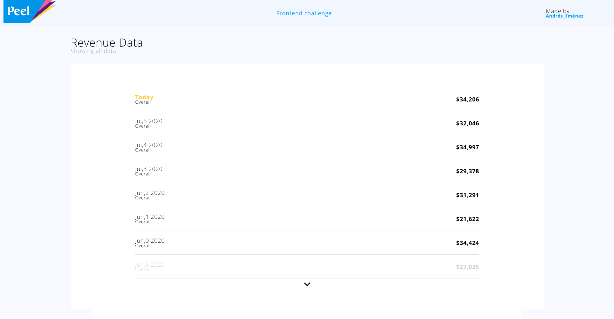
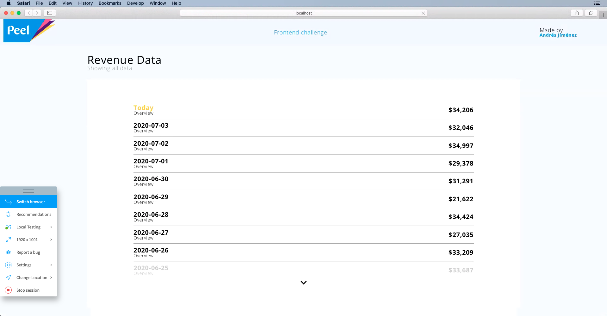
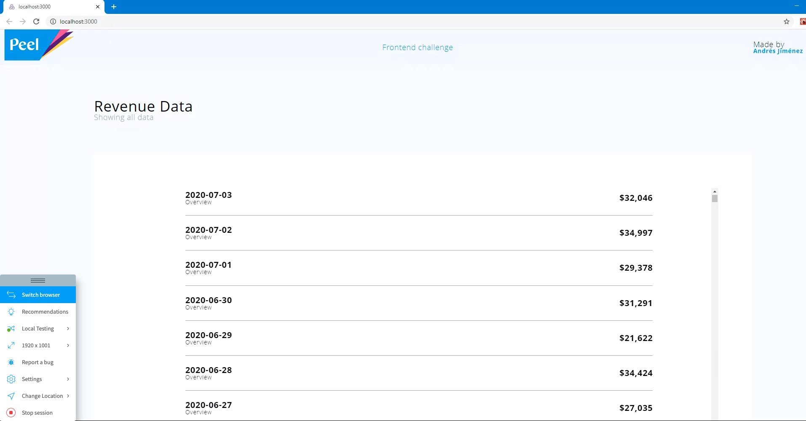
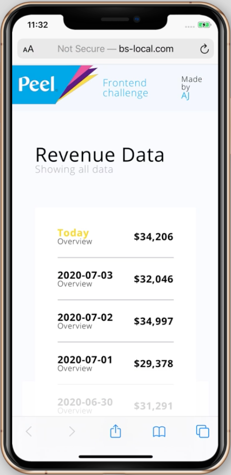
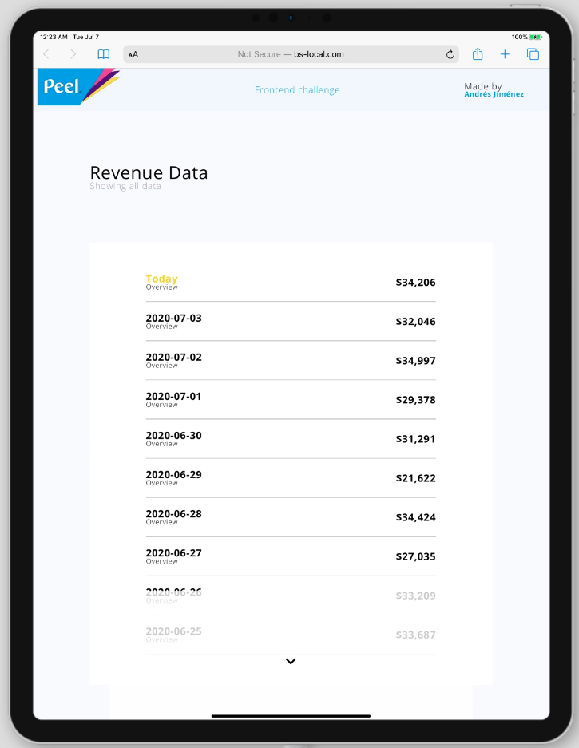
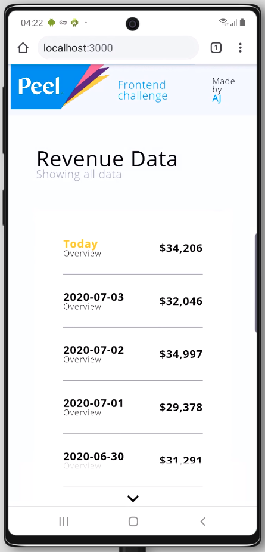
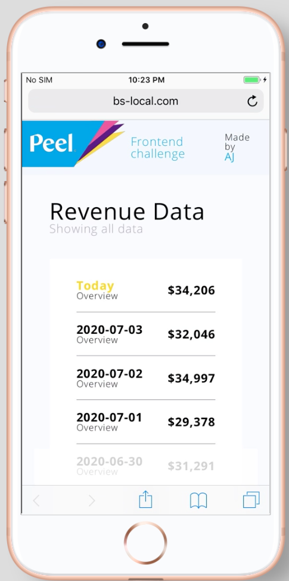

# Andres Jimenez Solution

### Instructions


Install the dependencies and devDependencies and start the server.

```sh
$ npm install 
$ npm run dev
$ npm run test (For testing)
```
## How this solution was developed

I’ve reached this solution applying the following working plan:

  

- Requirement summary and discovery work

- Design

- FE implementation

  
Each of these phases are documented to explain a little bit more my way of thinking and problem resolving skills.


## Requirement summary and discovery work


Main Goal

  
|                |MAIN GOAL                          |  
|----------------|-------------------------------|
||`Creating a responsive web app that can fluidly handle big amounts of data, be resilient to throttling, and any other issues that the API could return.`            |


|                |SPECIFIC GOAL                          |FIRST THOUGHTS                       |
|----------------|-------------------------------|-----------------------------|
||`Manages background pagination to allow a great lazy loading user experience.`            |'Use server-side rendering to load a 200 (This value could be edit in a constant or config file) batch to our application context'            |
|          |`Manages API throttling`            |"Try to load most of the data in advance so we can prevent errors to appear to the user, but In case of throttling occur when the user is interacting with the app, indicate the user with a loading icon and remaining time."            |
|         |`Manages API errors`|Handles a custom error hook that could pop up an error message in case something happens|
|         |`Responsive App`|Handles the app with a resilient flex design and media queries that grant a great user experience


##  First thoughts and discovery

  
After summarizing the requirements, I usually think about the best approach with the knowledge I currently have.


  

#### My first approach for logic

  

 - Create an SSR application that handles a heavy first API load on the server-side.   
  - All of that will be stored and managed by the app context. 
  - Each time the user scrolls down, more of the context data will show, and new data will be n the asynchronously fetched so, the context always has 5-10 paginations data in advance.  
  - In case the user scroll faster then the API throttling allows us to obtain our data, a loading icon will appear.    
   - Error message in case  anything else happens

#### For design:


- Use atomic design to create reusable components
- Flex design and media queries that grant a great user experience

#### Concerns or details to have in count :
- When using Redux with server rendering, we must also send the state of our app along in our response so the client can use it as the initial state.
- On the client-side, a new Redux store will be created and initialized with the state provided by the server. Redux's only job on the server-side is to provide the initial state of our app.

## Design & Diagram


### Solution

## Logic Unit Tests 



----------------------- --------------------------------------------------------------------------------------------

## Device Evidence 
*The evidence shows the responsiveness, some final details are not present in all of the screenshots. 
Ex:: The date.

```Chrome macOS```


``` macOS Catalina Safari``` 


```Chrome 83 Windows 10```
 

``` iPhone XS iOS 13 ```


```IPad Pro ```


``` Galaxy Note 10```
 

``` Iphone 8 ```


----------------------- --------------------------------------------------------------------------------------------
